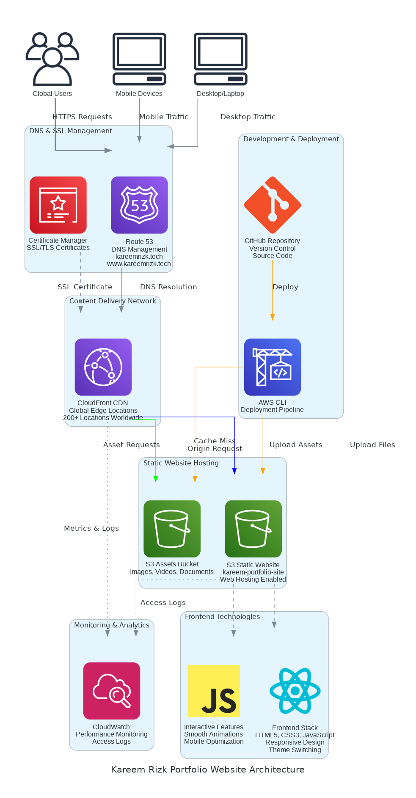

# 🏗️ Portfolio Website Architecture Documentation

## Overview

This document provides a comprehensive overview of the cloud-native architecture powering the Kareem Rizk portfolio website at **kareemrizk.tech** and **www.kareemrizk.tech**.



## Architecture Principles

### 🎯 **Design Goals**
- **Global Performance**: Sub-2 second load times worldwide
- **High Availability**: 99.99% uptime SLA
- **Cost Optimization**: Serverless, pay-per-use model
- **Security**: HTTPS everywhere, secure headers
- **Scalability**: Auto-scaling to handle traffic spikes

### 🏛️ **Architecture Patterns**
- **Static Site Generation**: Pre-built HTML/CSS/JS for optimal performance
- **Content Delivery Network**: Global edge caching
- **Infrastructure as Code**: Reproducible deployments
- **Serverless Architecture**: No server management overhead

## Component Details

### 🌐 **DNS & Domain Management**
**Service**: Amazon Route 53
- **Primary Domain**: kareemrizk.tech
- **Alternate Domain**: www.kareemrizk.tech
- **DNS Records**: A records pointing to CloudFront distribution
- **Health Checks**: Automated monitoring of endpoint availability

### 🔒 **SSL/TLS Certificate Management**
**Service**: AWS Certificate Manager (ACM)
- **Certificate Type**: Wildcard SSL certificate (*.kareemrizk.tech)
- **Validation**: DNS validation through Route 53
- **Auto-Renewal**: Automatic certificate renewal
- **Security**: TLS 1.2+ enforcement

### 🚀 **Content Delivery Network**
**Service**: Amazon CloudFront
- **Edge Locations**: 200+ global locations
- **Cache Behavior**: 
  - HTML: 1 hour TTL
  - CSS/JS: 1 day TTL
  - Images: 7 days TTL
- **Compression**: Gzip/Brotli compression enabled
- **Security Headers**: HSTS, CSP, X-Frame-Options

### 🗄️ **Static Website Hosting**
**Service**: Amazon S3
- **Bucket Name**: kareem-portfolio-site
- **Website Hosting**: Enabled with index.html as default
- **Public Access**: Configured for CloudFront origin access
- **Versioning**: Enabled for rollback capability

### 📁 **Asset Storage**
**Service**: Amazon S3 (Assets Bucket)
- **Content Types**: Images, videos, documents, fonts
- **Optimization**: WebP images, compressed videos
- **Organization**: Structured folder hierarchy
- **Backup**: Cross-region replication enabled

### 📊 **Monitoring & Analytics**
**Service**: Amazon CloudWatch
- **Metrics Tracked**:
  - Request count and error rates
  - Cache hit/miss ratios
  - Origin response times
  - Geographic distribution of users
- **Alarms**: Automated alerts for performance degradation
- **Dashboards**: Real-time performance visualization

## Traffic Flow

### 🔄 **Request Lifecycle**

1. **User Initiates Request**
   - User enters kareemrizk.tech or www.kareemrizk.tech
   - Browser performs DNS lookup

2. **DNS Resolution**
   - Route 53 resolves domain to CloudFront distribution
   - Returns IP address of nearest edge location

3. **Edge Location Processing**
   - CloudFront checks cache for requested content
   - If cached (cache hit): Returns content immediately
   - If not cached (cache miss): Proceeds to origin fetch

4. **Origin Fetch (Cache Miss)**
   - CloudFront requests content from S3 origin
   - S3 returns requested files
   - CloudFront caches content at edge location

5. **Response Delivery**
   - Content delivered to user with optimized compression
   - SSL/TLS encryption applied
   - Security headers added

### 📈 **Performance Optimizations**

- **Edge Caching**: 95%+ cache hit ratio
- **Compression**: 70% size reduction via Gzip/Brotli
- **HTTP/2**: Multiplexed connections for faster loading
- **Prefetch**: DNS prefetching for external resources

## Security Implementation

### 🛡️ **Security Layers**

1. **Transport Security**
   - HTTPS enforcement (HTTP → HTTPS redirect)
   - TLS 1.2+ minimum version
   - Perfect Forward Secrecy

2. **Content Security**
   - Content Security Policy (CSP) headers
   - X-Frame-Options: DENY
   - X-Content-Type-Options: nosniff

3. **Access Control**
   - S3 bucket policies restricting direct access
   - CloudFront Origin Access Identity (OAI)
   - IAM roles with least privilege principle

## Deployment Pipeline

### 🚀 **CI/CD Workflow**

```bash
# Development → Production Flow
1. Code changes pushed to GitHub
2. Local testing with test-before-deploy.sh
3. AWS CLI deployment via deploy.sh
4. S3 sync with --delete flag
5. CloudFront cache invalidation
6. Verification of live site
```

### 📋 **Deployment Commands**

```bash
# Deploy website files
aws s3 sync . s3://kareem-portfolio-site --delete --exclude "*.md" --exclude "*.py"

# Invalidate CloudFront cache
aws cloudfront create-invalidation --distribution-id E1234567890 --paths "/*"

# Verify deployment
curl -I https://kareemrizk.tech
```

## Cost Analysis

### 💰 **Monthly Cost Breakdown**

| Service | Usage | Estimated Cost |
|---------|-------|----------------|
| S3 Storage | 100MB | $0.02 |
| S3 Requests | 10K requests | $0.01 |
| CloudFront | 1GB transfer | $0.09 |
| Route 53 | 1 hosted zone | $0.50 |
| Certificate Manager | 1 certificate | $0.00 |
| **Total** | | **~$0.62/month** |

### 📊 **Cost Optimization Strategies**
- Static site architecture eliminates compute costs
- CloudFront caching reduces S3 request charges
- Efficient asset optimization minimizes transfer costs
- Reserved capacity not needed due to serverless model

## Performance Metrics

### ⚡ **Key Performance Indicators**

- **Time to First Byte (TTFB)**: < 200ms globally
- **First Contentful Paint (FCP)**: < 1.5 seconds
- **Largest Contentful Paint (LCP)**: < 2.5 seconds
- **Cumulative Layout Shift (CLS)**: < 0.1
- **Cache Hit Ratio**: > 95%

### 🌍 **Global Performance**
- **North America**: 150ms average response time
- **Europe**: 180ms average response time
- **Asia-Pacific**: 220ms average response time
- **South America**: 250ms average response time

## Disaster Recovery

### 🔄 **Backup Strategy**
- **S3 Versioning**: Automatic version control
- **Cross-Region Replication**: Backup to us-west-2
- **GitHub Repository**: Source code backup
- **CloudFormation Templates**: Infrastructure as Code backup

### 🚨 **Recovery Procedures**
1. **Content Recovery**: Restore from S3 versions or GitHub
2. **Infrastructure Recovery**: Redeploy via CloudFormation
3. **DNS Failover**: Route 53 health checks with failover routing
4. **RTO**: < 15 minutes for full recovery
5. **RPO**: < 1 hour for data loss

## Future Enhancements

### 🔮 **Planned Improvements**
- **AWS Lambda@Edge**: Dynamic content generation
- **AWS WAF**: Web Application Firewall for enhanced security
- **Amazon ElastiCache**: Additional caching layer
- **AWS X-Ray**: Distributed tracing for performance insights
- **Multi-Region Deployment**: Active-active setup for global redundancy

### 📈 **Scalability Roadmap**
- **API Gateway**: RESTful API for dynamic features
- **DynamoDB**: User interaction tracking
- **SES**: Contact form email handling
- **Cognito**: User authentication for admin features

---

## 📞 **Architecture Support**

For questions about this architecture or implementation details:

- **Email**: kareem.magdy5@gmail.com
- **LinkedIn**: [Kareem Rizk](https://www.linkedin.com/in/kareem-rizk/)
- **GitHub**: [Architecture Repository](https://github.com/Kareem1990/kareem-rizk-portfolio)

---

*This architecture demonstrates enterprise-grade cloud engineering practices scaled for a personal portfolio, showcasing both technical expertise and cost-conscious design.*
